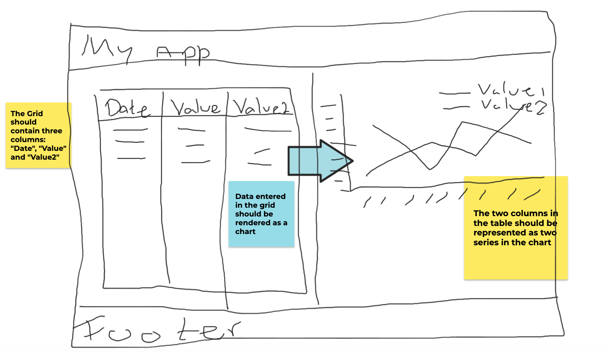
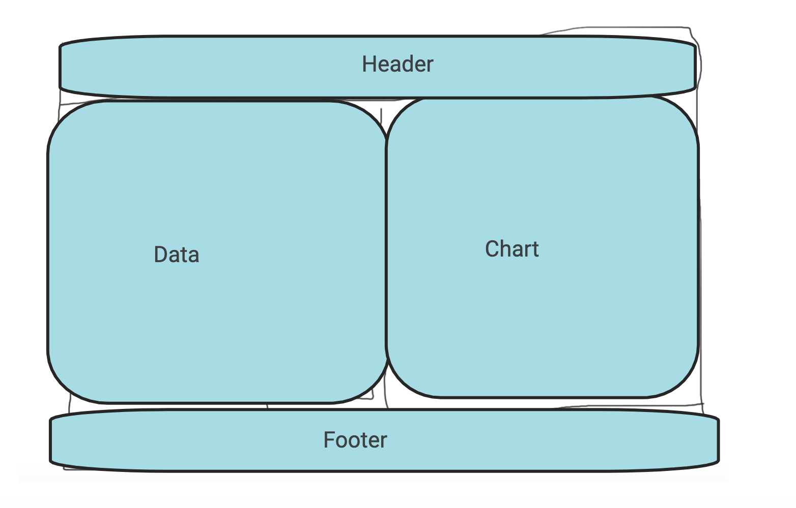

## ReelMetrics assignment

The assignment is to create a small UI where one can enter data in a datatable, and to visualize that in a chart.

The goal is not to write perfect code, or understand or demonstrate expert knowledge in Plotly, Dvexpress or the CSS Grid. It's rather to demonstrate the ability to apply new packages and concepts quickly. 

> *Give a man a fish and you feed him for a day. Teach him how to fish and you feed him for his life time.*

The layout is quite simple with 4 blocks: Header, Footer, Data and Chart. You should create this layout by using CSS Grid. 

The user should be able to add data to a grid containing three columns `Date`, `Value` (numeric) and `Value2` (numeric). Rows that have been entered in the grid should appear in the Chart as a line-chart. `Value` as a serie and `Value2` as a serie.

Technical requirements:
- [Plotly](https://plotly.com/javascript/react/) for the chart
- [Devexpress](https://js.devexpress.com/Demos/WidgetsGallery/Demo/DataGrid/CellEditingAndEditingAPI/React/Light/) for the datatable
- [Grid](https://learncssgrid.com/) for the arrangement of the page
- You should use [Functional components]() and hooks for the React components.

Tips:
- For the DevExpress grid, set the edit mode to `mode="cell"`
- DevExpress has a lot of example code on their web site.

Nice to have (if time allows): 
- Apply some more CSS to the project to make it a bit pretty
- Add one test to the project

# About this project

This project was bootstrapped with [Create React App](https://github.com/facebook/create-react-app). 

To get started make sure you have NodeJS installed, and you have run `npm install` within the project to install all the dependencies.

## Available Scripts

In the project directory, you can run:

### `npm start`

Runs the app in the development mode.\
Open [http://localhost:3000](http://localhost:3000) to view it in the browser.

The page will reload if you make edits.\
You will also see any lint errors in the console.

### `npm test`

Launches the test runner in the interactive watch mode.\
See the section about [running tests](https://facebook.github.io/create-react-app/docs/running-tests) for more information.
# project-2
# project-2
# project-2
